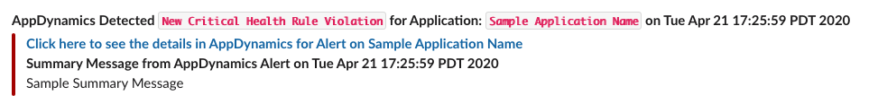
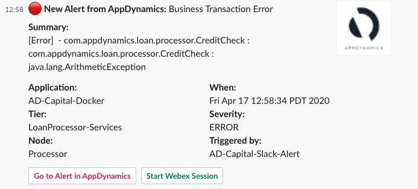

# AppD-Alert-Templates
*Slack Examples* - Below are 2 examples templates that work in slack. 
- **Version 1** example is a very basic example below you can see what a sample alert looks like. 

- **Version 3.1** is a new version written in slacks blocks using special varables from AppDynamics. Below is an example in slack. 

